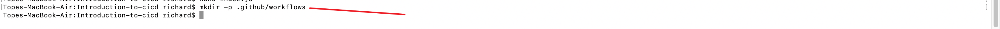
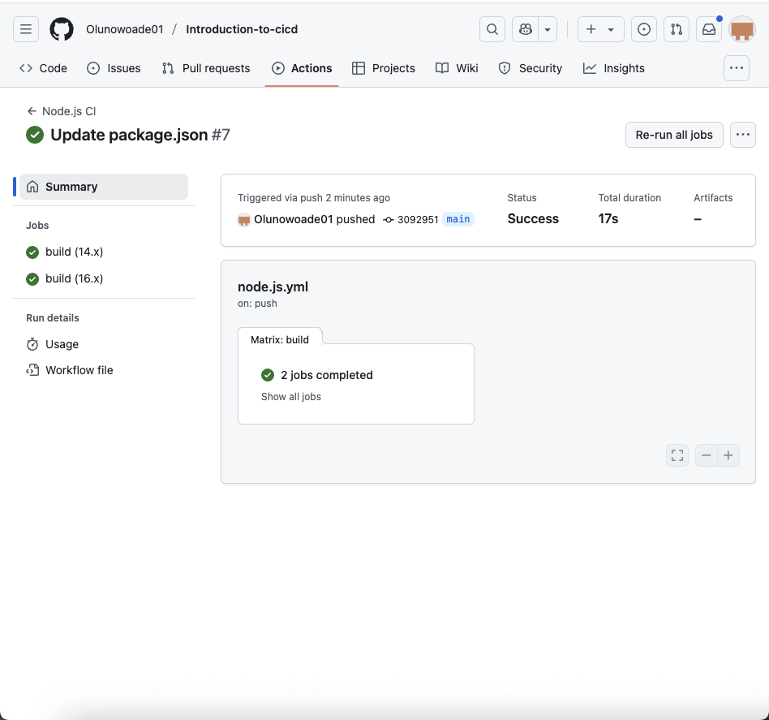

# Introduction-to-cicd
Introduction to continuous Integration and continuous Deployment

## Project Overview
This project demonstrates how to set up a simple Node.js application and implement Continuous Integration and Continuous Deployment (CI/CD) using GitHub Actions. The goal is to automate testing and deployment of the application across different Node.js versions.

## Pre-requisites
- Basic knowledge of Git and GitHub
- Understanding of basic programming concepts
- Familiarity with Node.js and npm
- Text editor or IDE
- Local development environment
- Internet connection
- Basic understanding of CI/CD concepts

---

  
*Step 1: GitHub repository created for the project.*

  
*Step 2: Repository cloned to the local machine.*

  
*Step 3: Node.js installed using Homebrew on Mac.*

  
*Step 4: Node.js project initialized with npm.*

  
*Step 5: Express.js installed as a project dependency.*

  
*Step 6: Simple Express server script created.*

  
*Step 7: Another view of the Express server script.*

  
*Step 8: Running the Node.js application locally.*

  
*Step 9: Confirmation that the server script is working.*

  
*Step 10: Project files and structure in the code editor.*

  
*Step 11: Opening the project in Visual Studio Code.*

  
*Step 12: Reviewing the server script in the editor.*

  
*Step 13: Final project setup and verification.*

